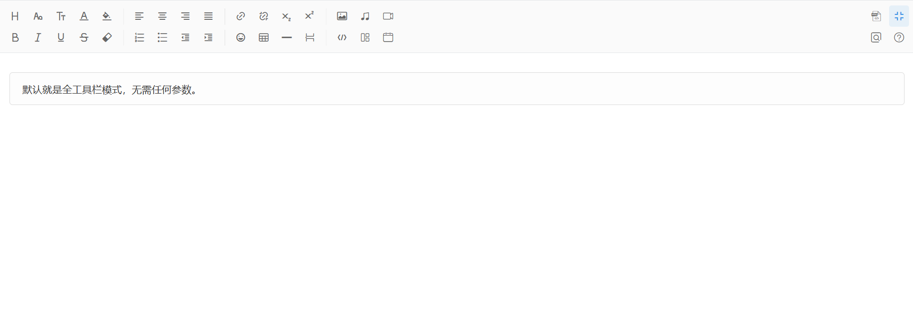

### 介绍
sdEditor基于Jquery开发的轻量级、所见即所得的web富文本编辑器，体积小、安全性高、同时支持一个页面多次调用，支持移动端自适应使用。
### 原生使用
```
<script src="你的路径/editor/editor.js"></script>
<script>
$(function()
{
    $("#content").editor();
});
</script>
```
```
<div id="content"></div>
```
### 截图

### 演示
[演示地址](https://geh3408.top/sdeditor)
### 联系方式


